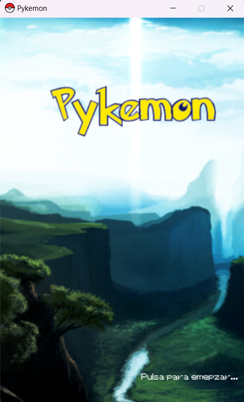
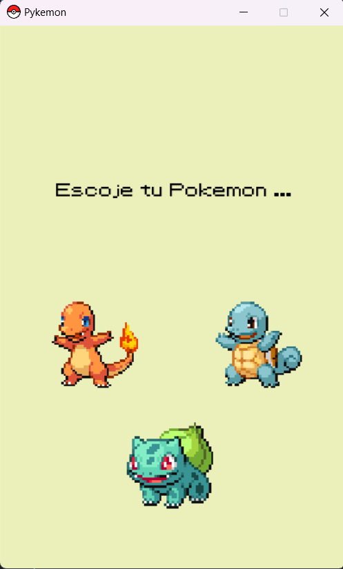
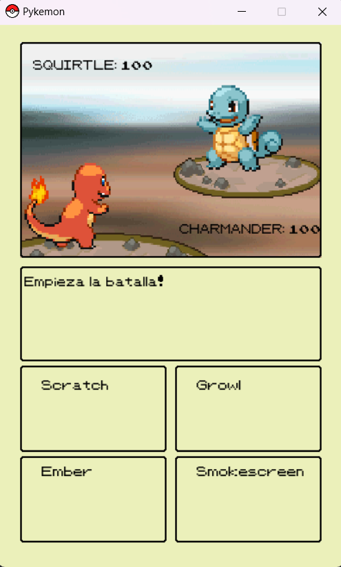
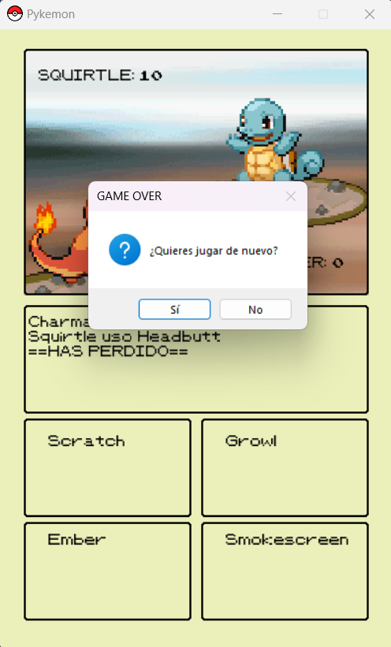

# Pykemon
Entrego este porque el juego esta acabado,
    pero no tengo tiempo para terminar las tareas siguientes.

    - Optimizar codigo
        - Crear classes para las pantallas
        - Crear funciones para absolutamente todo

### Capturas de pantalla

